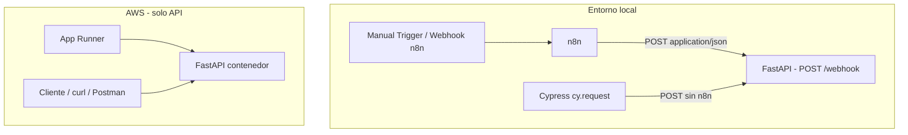

# Arquitectura — Orquestador Notificador de Chats

## Contexto

PoC que automatiza la revisión de mensajes simulados: un flujo **n8n** envía mensajes a una **API REST**, que decide si el contenido requiere atención inmediata según palabras clave definidas en el enunciado.

## Diagrama de componentes

## Contrato de la API

| Aspecto | Valor |
|---------|--------|
| Método y ruta | `POST /webhook` |
| Request body | `{"user": string, "message": string}` |
| Regla de negocio | Si `message` contiene `urgente`, `error` o `ayuda` (case-insensitive) → `alert: true` |
| Respuesta | HTTP `200`, body `{"alert": boolean}` |

## Responsabilidades por capa

### `backend/app/api/`

- Rutas HTTP, validación de entrada (Pydantic), códigos de respuesta.

### `backend/app/services/`

- Lógica pura de evaluación de alertas (sin dependencia de FastAPI).

### `backend/app/core/`

- Configuración desde variables de entorno (`Settings`).

### `n8n/`

- Workflow exportado en JSON versionado en el repo.

### `cypress/`

- Verificación del contrato de la API en local (sin UI).

### Docker

- **Dockerfile** (`backend/Dockerfile`): imagen basada en `python:3.12-slim`, expone puerto `8000`, ejecuta `uvicorn app.main:app`.
- **Build context:** directorio `backend/` (no la raíz del repo).
- **docker-compose.yml** (Fase 5): servicios `api` y `n8n` en red compartida; n8n llama a `http://api:8000/webhook`.

## Decisiones técnicas

| Decisión | Elección | Motivo |
|----------|----------|--------|
| Lenguaje / framework | Python + FastAPI | Rapidez, tipado, fácil sustentación |
| Orquestación | n8n local | Requisito del enunciado; no se despliega en AWS |
| Cloud | AWS App Runner | Misma imagen Docker que local; despliegue rápido |
| Pruebas | Cypress `cy.request` | Cumple requisito de Cypress para POST directo |

## Seguridad (alcance PoC)

- Sin autenticación en el endpoint (no exigido por el enunciado).
- Variables sensibles solo vía `.env` (no commitear).
- En producción real se añadirían API keys, HTTPS obligatorio y rate limiting.

## Evolución por fases

Ver roadmap en `README.md`. Cada fase extiende este documento si cambia algún componente.
