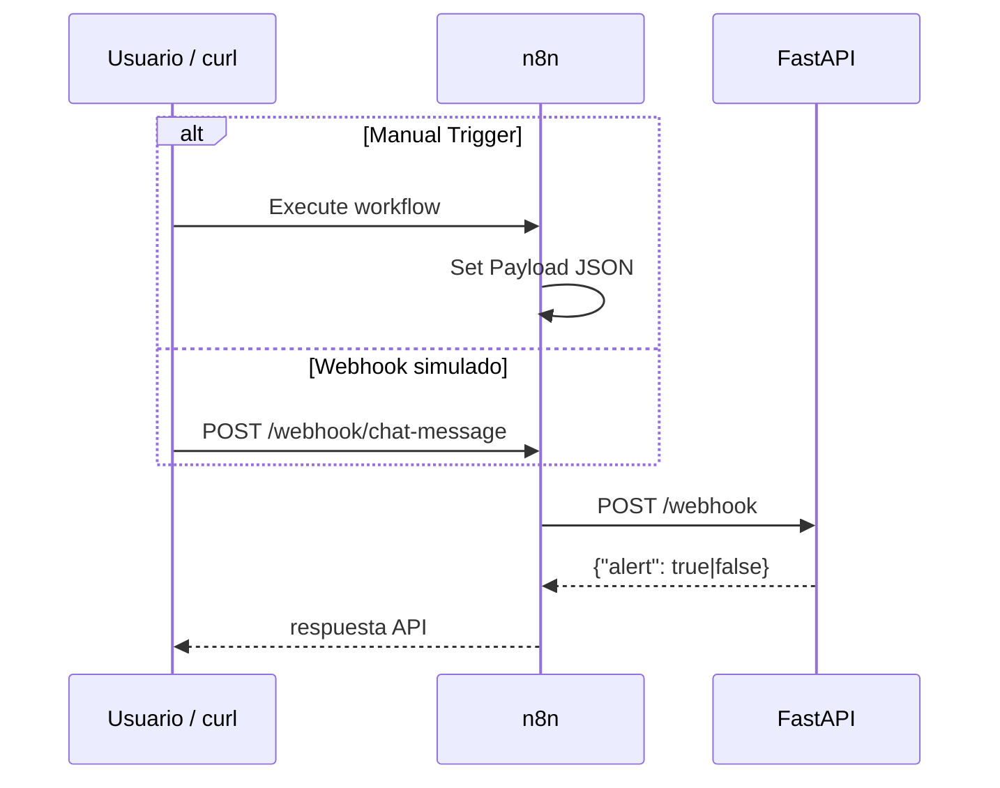

# Workflow n8n — Fase 6

## Archivos exportados

| Archivo | Trigger | Uso |
|---------|---------|-----|
| `n8n/workflow-orquestador.json` | Manual Trigger | Demo en sustentación (clic en Execute) |
| `n8n/workflow-orquestador-webhook.json` | Webhook POST | Simular mensaje entrante vía HTTP |

Ambos cumplen el requisito del enunciado: *trigger manual **o** webhook simulado*.

## Pre-requisitos

```powershell
docker compose up -d
```

- API: http://localhost:8000
- n8n: http://localhost:5678

## Importar workflow

1. Abre http://localhost:5678 y completa el onboarding (primera vez).
2. Menú **⋯** (arriba derecha) → **Import from File**.
3. Selecciona `n8n/workflow-orquestador.json`.
4. Guarda el workflow (**Ctrl+S**).

> Si la API corre **fuera** de Docker, edita el nodo **POST Webhook API** y cambia la URL a `http://localhost:8000/webhook` (solo desde n8n instalado en host, no desde contenedor).

## Probar — Manual Trigger (recomendado para demo)

1. Abre el workflow importado.
2. En el nodo **Set Payload** puedes editar `message`:
   - `Necesito ayuda urgente` → respuesta API `{"alert": true}`
   - `Todo funciona bien` → `{"alert": false}`
3. Clic en **Execute workflow** (o **Test workflow**).
4. Revisa el nodo **POST Webhook API** → salida con `alert: true|false`.

```text
Manual Trigger → Set Payload → POST http://api:8000/webhook → {"alert": ...}
```

## Probar — Webhook simulado

1. Importa `n8n/workflow-orquestador-webhook.json`.
2. **Activa** el workflow (toggle **Active** arriba a la derecha).
3. Abre el nodo **Webhook Simulado** y copia la **Production URL** (ej. `http://localhost:5678/webhook/chat-message`).
4. Envía el payload:

```powershell
curl -X POST http://localhost:5678/webhook/chat-message `
  -H "Content-Type: application/json" `
  -d '{"user":"nombre","message":"Necesito ayuda"}'
```

La respuesta del curl será la de la API: `{"alert":true}`.

## Flujo completo



## Re-exportar después de cambios

1. En n8n: menú **⋯** → **Download**.
2. Sobrescribe el archivo en `n8n/` del repositorio.
3. Commit con el JSON actualizado.

## Errores comunes

| Error | Causa | Solución |
|-------|--------|----------|
| `ECONNREFUSED` en HTTP Request | URL `localhost:8000` dentro de n8n Docker | Usar `http://api:8000/webhook` |
| Webhook 404 | Workflow no activado | Activar workflow (webhook) |
| `alert` siempre false | Mensaje sin keywords | Usar `urgente`, `error` o `ayuda` |
| Import falla | JSON corrupto | Re-importar desde repo |
